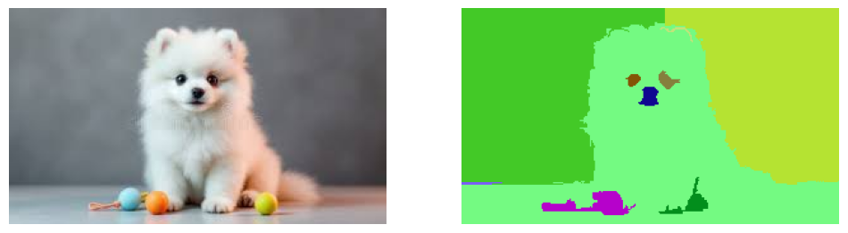
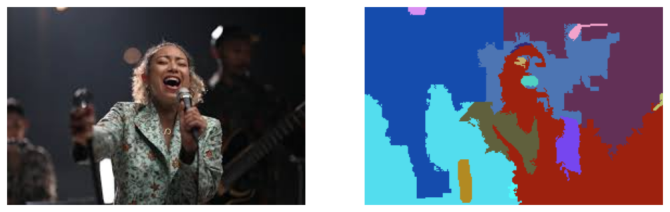

# Graph-Based Image Segmentation Using Union-Find (FH Algorithm)

## Overview
This project implements the **Felzenszwalb–Huttenlocher (FH)** graph-based image segmentation algorithm from scratch using the **Union-Find (Disjoint Set Union)** data structure. The objective is to understand how Union-Find efficiently clusters similar pixels into coherent regions in an unsupervised manner.

---

## Objectives
- Implement Union-Find with **path compression** and **union by rank**
- Build the FH segmentation algorithm **from scratch**
- Dynamically load images from:
  - Sample datasets
  - User uploads
  - URLs (optional)
- Analyze segmentation behavior under different parameters
- Visualize segmentation results and individual segments

---

## Image Loading & Preprocessing
Supported input types:
- Sample images (`skimage.data`)
- Uploaded images (Google Colab)
- Image URLs

Preprocessing steps:
- Optional grayscale conversion
- Optional Gaussian smoothing (`sigma`)

---

## Algorithm Description
- Each pixel is treated as a **graph node**
- Edges connect neighboring pixels with weights based on intensity or color difference
- Edges are processed in increasing order of weight
- Regions are merged using Union-Find if the edge weight satisfies the adaptive threshold
- Small regions are merged using a minimum size constraint

Union-Find enables efficient region merging and connectivity queries during segmentation.

---

## Experiments
Segmentation results are compared across different values of:
- `k` (scale parameter)
- `min_size` (minimum region size)
- `sigma` (smoothing factor)

For each configuration:
- The number of segments is computed
- Side-by-side visualizations are generated
- Individual segments are displayed

---

## Results & Observations
- Smaller `k` values produce finer segmentations
- Larger `k` values result in coarser regions
- Increasing `sigma` reduces noise and small fragmented regions
- Union-Find provides scalable and efficient segmentation performance

---

## Tools Used
- NumPy
- Matplotlib
- Scikit-image (image I/O, color conversion, Gaussian filter)
- OS utilities

No prebuilt segmentation, clustering, or graph libraries were used.

---

## Key Takeaways
- Union-Find is well-suited for graph-based image segmentation
- FH segmentation adapts naturally to image structure without supervision
- Parameter tuning has a significant impact on segmentation quality
- Implementing the algorithm from scratch improves understanding of graph-based vision methods

---

## Submission Details
- **Format:** Single Google Colab notebook
- **Contents:** Implementation, visualizations, and observations
- **Output:** Original image and segmentation results (minimum three parameter settings)
- **Upload Location:** `Jan 10 Group 2 Training`
- **Filename:** *Your Full Name*


**Article:** [Efficient Graph-Based Image Segmentation](https://soumik12345.github.io/geekyrakshit-blog/algebra/computervision/convolution/maths/python/2020/09/17/efficient-graph-based-image-segmentation.html)

## Usage

Install using `pip install felzenszwalb-segmentation`.

```python
from felzenszwalb_segmentation import segment

segmented_image = segment(in_image, sigma, k, min_size)
```

## Results





